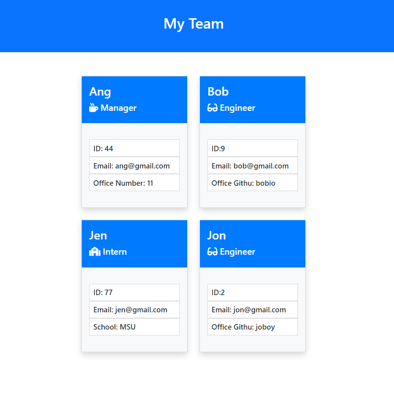

# Team Profile Template

  

## Table-of-Contents

  * [Description](#description)
  * [Installation](#installation)
  * [Usage](#usage)
  * [License](#license)
  * [Contributers](#contributers)
  * [Tests](#tests)
  * [Questions](#questions)
  

  ## [Description:](#table-of-contents)

  #### Generated a webpage that displays a team's basic info creating quick access to their Emails and GitHub profiles. 

  ## [Installation](#table-of-contents)

  #### Node, Inquirer

  ## [Usage](#table-of-contents)

  #### Open coding terminal, run program, and enter prompts.
  #### Click [Here](https://drive.google.com/file/d/1J3y2N4x6qyeDTb7TifRseb-ugU0bZ6aZ/view) for a live video demonstration.

  

  
  ## License
    
  The application is covered under the following license:
    
  
  
    

  ## [Contributers](#table-of-contents)

  * Angela Gola

  ## [Tests](#table-of-contents)

  #### Open coding terminal, run program, and follow question prompts.

  ## [Questions](#table-of-contents)

  Please contact me using the following links:
  

  * [GitHub](http://github.com/angelagola-ko)

  * [Email: angelagola.ko@gmail.com](mailto:angelagola.ko@gmail.com)

  